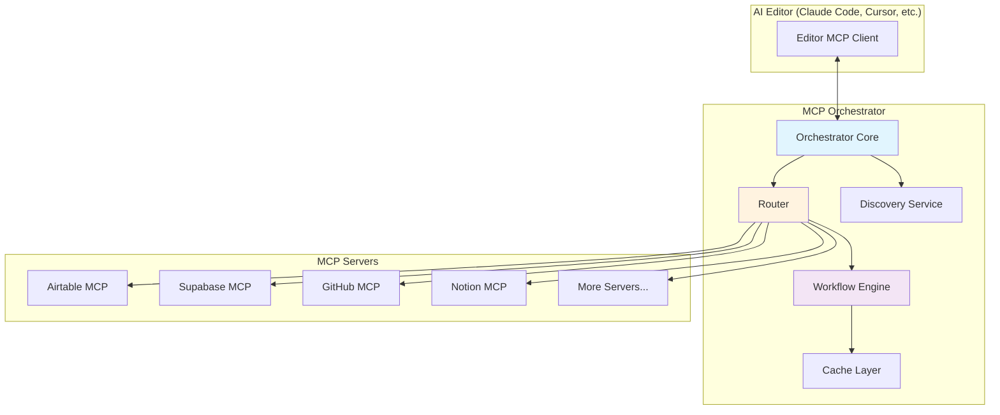

# 🎯 MCP Orchestrator

> **One MCP Server to Rule Them All**

[](https://modelcontextprotocol.io/)
[](https://www.npmjs.com/package/@mcp-orchestrator/server)
[](https://opensource.org/licenses/MIT)

## 🌟 Overview

MCP Orchestrator is a meta-MCP server that acts as a single interface to coordinate multiple MCP servers. Instead of configuring dozens of MCP servers in your editor, configure just one - the Orchestrator - and it manages all the others.

## 🚀 The Problem It Solves

Currently, to use multiple MCP servers in Claude Code or other editors, you need to:
- Configure each server individually
- Remember which server has which tools
- Manually coordinate operations between servers
- Handle different authentication methods

**MCP Orchestrator changes this:**
- Configure once, access everything
- Intelligent routing to the right server
- Cross-server workflows with one command
- Unified authentication management

## ✨ Key Features

### 🔌 **Single Configuration**
```json
{
  "mcpServers": {
    "orchestrator": {
      "command": "npx",
      "args": ["@mcp-orchestrator/server"],
      "env": {
        "MCP_SERVERS": "airtable,supabase,github,notion,slack"
      }
    }
  }
}
```

### 🧠 **Intelligent Routing**
```
User: "List all tables in my database"
Orchestrator: *Automatically routes to Airtable/Supabase based on context*

User: "Copy tasks from Airtable to Notion"
Orchestrator: *Coordinates between both servers seamlessly*
```

### 🔄 **Cross-Server Workflows**
```typescript
// One command, multiple servers
"Sync my Airtable CRM to Supabase, update Slack, and create GitHub issues"
```

### 🎯 **Smart Tool Discovery**
- Automatically discovers tools from all connected servers
- Presents unified tool list to the editor
- Handles tool name conflicts intelligently

## 📦 Installation

### Quick Start (NPM)
```bash
# Install globally
npm install -g @mcp-orchestrator/server

# Or use directly with npx
npx @mcp-orchestrator/server
```

### Configure in Claude Code
Add to your `claude_desktop_config.json`:

```json
{
  "mcpServers": {
    "orchestrator": {
      "command": "npx",
      "args": ["@mcp-orchestrator/server"],
      "env": {
        "MCP_ORCHESTRATOR_CONFIG": "~/.mcp-orchestrator/config.yml"
      }
    }
  }
}
```

## 🔧 Configuration

### Basic Configuration
Create `~/.mcp-orchestrator/config.yml`:

```yaml
servers:
  airtable:
    package: "@rashidazarang/airtable-mcp"
    version: "3.2.4"
    env:
      AIRTABLE_TOKEN: ${AIRTABLE_TOKEN}
      AIRTABLE_BASE_ID: ${AIRTABLE_BASE_ID}
  
  supabase:
    package: "@supabase/mcp-server"
    env:
      SUPABASE_URL: ${SUPABASE_URL}
      SUPABASE_KEY: ${SUPABASE_KEY}
  
  github:
    package: "@modelcontextprotocol/server-github"
    env:
      GITHUB_TOKEN: ${GITHUB_TOKEN}
  
  notion:
    package: "@mcp-servers/notion"
    env:
      NOTION_TOKEN: ${NOTION_TOKEN}

routing:
  smart_routing: true
  cache_enabled: true
  parallel_execution: true

workflows:
  - name: "sync_databases"
    description: "Sync between Airtable and Supabase"
    steps:
      - server: airtable
        tool: list_records
      - transform: map_schema
      - server: supabase
        tool: batch_insert
```

### Environment Variables
Store credentials in `.env`:
```bash
# Airtable
AIRTABLE_TOKEN=your_token
AIRTABLE_BASE_ID=your_base

# Supabase
SUPABASE_URL=https://xxx.supabase.co
SUPABASE_KEY=your_key

# GitHub
GITHUB_TOKEN=ghp_xxx

# Notion
NOTION_TOKEN=secret_xxx
```

## 💡 Usage Examples

### Example 1: Simple Tool Execution
```
User: "List all my GitHub repositories"
```
The Orchestrator automatically routes this to the GitHub MCP server.

### Example 2: Cross-Server Operation
```
User: "Copy all tasks from Airtable 'Projects' table to Notion database"
```
The Orchestrator:
1. Fetches records from Airtable
2. Transforms the data format
3. Creates pages in Notion
4. Returns summary

### Example 3: Complex Workflow
```
User: "For each high-priority issue in GitHub, create a task in Airtable and notify Slack"
```
The Orchestrator coordinates between three servers automatically.

### Example 4: Natural Language Query
```
User: "Show me all customer data"
```
The Orchestrator intelligently determines which server(s) contain customer data.

## 🏗️ Architecture



## 🛠️ Advanced Features

### Intelligent Routing
The Orchestrator uses multiple strategies to route requests:
- **Keyword matching**: Recognizes service-specific terms
- **Tool analysis**: Routes based on tool availability
- **Context awareness**: Learns from previous interactions
- **Fallback handling**: Tries alternative servers if primary fails

### Workflow Composition
Define reusable workflows:
```yaml
workflows:
  daily_sync:
    schedule: "0 9 * * *"
    steps:
      - airtable.list_records: { table: "Tasks" }
      - filter: { status: "pending" }
      - github.create_issue: { repo: "my-repo" }
      - slack.send_message: { channel: "updates" }
```

### Tool Aggregation
Combines similar tools from different servers:
```
orchestrator.list_all_data()
  → airtable.list_records()
  → supabase.query()
  → notion.query_database()
  → Combined results
```

### Caching & Performance
- Intelligent result caching
- Parallel execution when possible
- Connection pooling
- Automatic retry with backoff

## 🔌 Supported MCP Servers

### Currently Integrated
- ✅ Airtable (@rashidazarang/airtable-mcp)
- ✅ Supabase (@supabase/mcp-server)
- ✅ GitHub (@modelcontextprotocol/server-github)
- ✅ Notion (@mcp-servers/notion)
- ✅ Slack (@modelcontextprotocol/server-slack)
- ✅ PostgreSQL (@modelcontextprotocol/server-postgres)
- ✅ Filesystem (@modelcontextprotocol/server-filesystem)

### Coming Soon
- 🔜 Google Sheets
- 🔜 Stripe
- 🔜 MongoDB
- 🔜 Elasticsearch
- 🔜 Discord
- 🔜 Linear
- 🔜 Jira

### Add Your Own
```typescript
// Easy to add new servers
orchestrator.registerServer({
  name: 'custom-api',
  package: '@company/custom-mcp',
  matcher: (query) => query.includes('custom'),
  transform: (data) => standardFormat(data)
});
```

## 📊 Monitoring & Debugging

### Built-in Dashboard
```bash
# Start with dashboard
mcp-orchestrator --dashboard

# View at http://localhost:9999
```

### Logging
```bash
# Enable debug logging
MCP_ORCHESTRATOR_LOG=debug npx @mcp-orchestrator/server
```

### Metrics
- Request routing statistics
- Server performance metrics
- Cache hit rates
- Error tracking

## 🤝 Contributing

We welcome contributions! See [CONTRIBUTING.md](CONTRIBUTING.md) for guidelines.

### Development Setup
```bash
# Clone repository
git clone https://github.com/rashidazarang/mcp-orchestrator.git
cd mcp-orchestrator

# Install dependencies
npm install

# Run in development mode
npm run dev

# Run tests
npm test
```

## 🗺️ Roadmap

### Phase 1: Core (Current)
- [x] Basic routing to multiple servers
- [x] Tool aggregation
- [x] Simple workflows
- [ ] Caching layer

### Phase 2: Intelligence
- [ ] Natural language understanding
- [ ] Smart routing algorithm
- [ ] Learning from usage patterns
- [ ] Automatic retry and fallback

### Phase 3: Advanced
- [ ] Visual workflow builder
- [ ] Server marketplace integration
- [ ] Custom transformation pipelines
- [ ] Distributed execution

### Phase 4: Enterprise
- [ ] Multi-tenant support
- [ ] Advanced security features
- [ ] Audit logging
- [ ] SLA monitoring

## 📄 License

MIT License - see [LICENSE](LICENSE) file

## 🙏 Acknowledgments

- Built on [Model Context Protocol](https://modelcontextprotocol.io/) by Anthropic
- Inspired by the growing MCP ecosystem
- Thanks to all MCP server developers

## 📞 Support

- **Issues**: [GitHub Issues](https://github.com/rashidazarang/mcp-orchestrator/issues)
- **Discussions**: [GitHub Discussions](https://github.com/rashidazarang/mcp-orchestrator/discussions)
- **Twitter**: [@mcp_orchestrator](https://twitter.com/mcp_orchestrator)

---

**🎯 One Server, Infinite Possibilities**

*Making multi-server MCP coordination effortless*